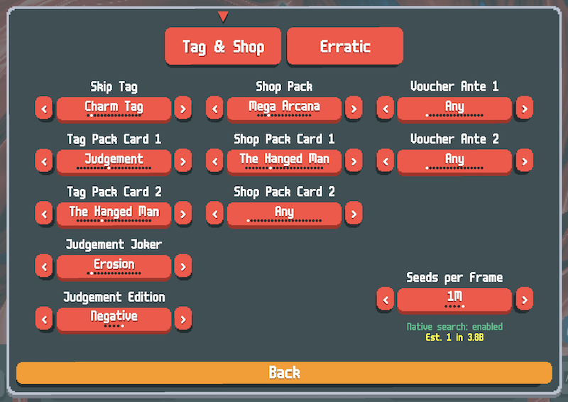
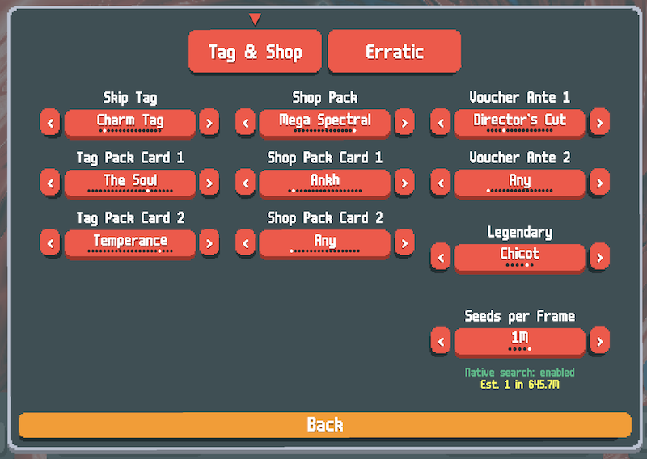
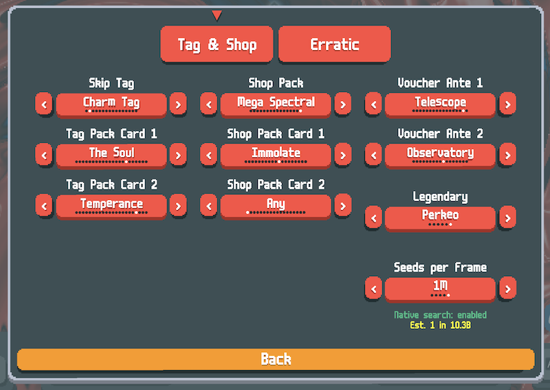
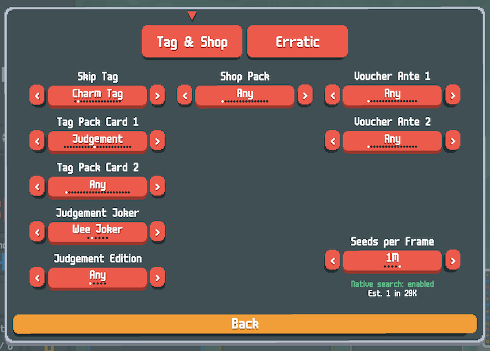
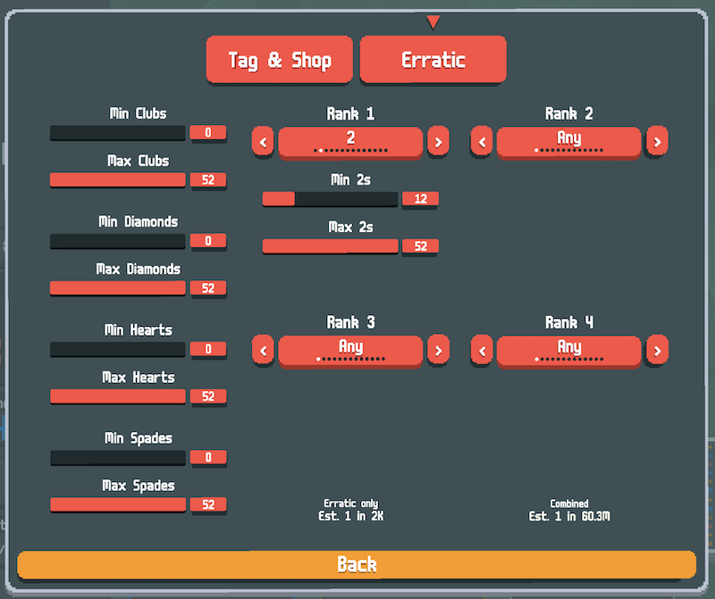

# Green Needle

A [Balatro](https://www.playbalatro.com/) mod for searching game seeds that match specific criteria. Find seeds with the exact skip tag, shop pack, vouchers, legendary joker, pack contents (tarot, spectral, planet, and joker cards), and erratic deck composition you want before starting a run. Inspired by [Brainstorm](https://github.com/OceanRamen/Brainstorm), with a native C search engine, additional search filters, and a different approach to seed prediction.

Requires the [Lovely](https://github.com/ethangreen-dev/lovely-injector) mod loader.

*Charm Tag with Judgement + The Hanged Man, Mega Arcana shop pack with The Hanged Man, filtering for a Negative Erosion from Judgement:*



*Charm Tag with The Soul + Temperance, Mega Spectral with Ankh, Director's Cut voucher, and Chicot legendary:*



*The Soul + Temperance in the tag pack, Mega Spectral with Immolate, Telescope + Observatory vouchers, and Perkeo legendary — estimate in yellow at ~1 in 10.3B:*



*The search overlay shows a running count of seeds checked vs. the estimated total, an elapsed timer, and the cumulative probability that a match should have been found by now:*


### Example: Wee Joker on Erratic Deck

*Tag & Shop settings — Charm Tag with Judgement, filtering for Wee Joker from Judgement:*



*Erratic tab — filtering for at least 12 copies of the 2 rank, with erratic estimate (~1 in 2K) and combined estimate (~1 in 60.3M):*



*Search overlay showing progress against the combined estimate:*


*Results — the erratic deck composition and the Arcana Pack with Judgement:*


## Features

- Search for seeds matching any combination of:
  - **Skip tag** (Charm Tag, Double Tag, Uncommon Tag, Rare Tag, etc.)
  - **Tag pack cards** (specific tarot cards in the Charm Tag's Mega Arcana pack)
  - **Uncommon/Rare Tag joker** — when Uncommon or Rare Tag is selected, filter for a specific joker from the corresponding rarity pool
  - **Shop pack type** (Arcana, Spectral, Celestial, Buffoon, etc. — including size variants)
  - **Shop pack cards** (specific tarot, spectral, planet, or joker cards in the shop pack)
  - **Buffoon pack joker** — paginated joker selector for buffoon packs, with rarity-aware probability estimates
  - **Buffoon edition** — filter the edition (Foil, Holographic, Polychrome, Negative) of jokers in buffoon packs
  - **Planet/celestial pack cards** — filter for specific planet cards in celestial packs
  - **Wraith joker** — when Wraith is selected as a shop pack card, optionally filter for a specific rare joker it creates
  - **Wraith edition** — filter the edition of the Wraith joker
  - **Judgement joker** — when Judgement is selected as a tag or shop pack card, filter for a specific joker it creates (paginated selector with all unlocked jokers)
  - **Judgement edition** — filter the edition of the Judgement joker
  - **Erratic deck filtering** — on a separate tab, filter the randomized deck composition by suit counts and rank counts (e.g. at least 12 copies of the 2 rank), with independent erratic and combined seed estimates
  - **Voucher Ante 1** (Telescope, Crystal Ball, etc.)
  - **Voucher Ante 2** (dynamically filtered based on Ante 1 selection)
  - **Legendary joker** (Canio, Perkeo, etc.) — appears when The Soul is selected in any card slot
- **Estimated seed count** shown in the settings panel and search overlay so you know roughly how many seeds to expect before finding a match
- **Cumulative likelihood** percentage displayed during search
- Native C search engine for fast multi-threaded searching (~millions of seeds/sec)
- Pure Lua fallback if the native library isn't available
- Live counter showing seeds searched and estimated total

## Installation

1. Install [Lovely](https://github.com/ethangreen-dev/lovely-injector) if you haven't already
2. Copy the `GreenNeedle` folder into your Balatro mods directory:
   - **macOS:** `~/Library/Application Support/Balatro/Mods/`
   - **Windows:** `%AppData%/Balatro/Mods/`
3. Launch Balatro — a **Green Needle** button will appear in the main menu

The mod works on all platforms via the pure-Lua search fallback. Pre-built native libraries are included for macOS (`greenneedle.dylib`) and Windows (`greenneedle.dll`) — see the Building section below if you'd like to recompile.

## Usage

1. Click the **Green Needle** button in the main menu (or pause menu)
2. Configure your search filters (any combination)
3. Start or be in a run, then press **Ctrl+A** to start searching
4. Press **Ctrl+A** again to stop the search
5. When a matching seed is found, a new run starts automatically with that seed

### Seeds per Frame

The **Seeds/Frame** option controls how many seeds are tested per game frame. Higher values search faster but may cause the game to stutter or freeze during the search. With the native library, the default of 100K is a good balance — increase to 500K or 1M if your machine handles it smoothly, or decrease to 1K or 10K if you experience lag. The pure-Lua fallback is much slower, so lower values are recommended there.

## Building the Native Library

The native search library provides dramatically faster searching. Pre-built for macOS (universal binary: Apple Silicon arm64 + Intel x86_64) and Windows (x86_64).

To rebuild on macOS:

```bash
cd native
./build_macos.sh
```

Requires Xcode Command Line Tools (`xcode-select --install`).

To cross-compile the Windows DLL from macOS:

```bash
brew install mingw-w64
cd native
./build_windows.sh
```

The C source (`native/greenneedle.c`) is portable C11 — it can also be compiled natively on Windows or Linux with any C11 compiler.

## Settings

Settings are saved automatically to `settings.lua` in the mod directory. Delete this file to reset to defaults.

## License

[Mozilla Public License 2.0](LICENSE)
