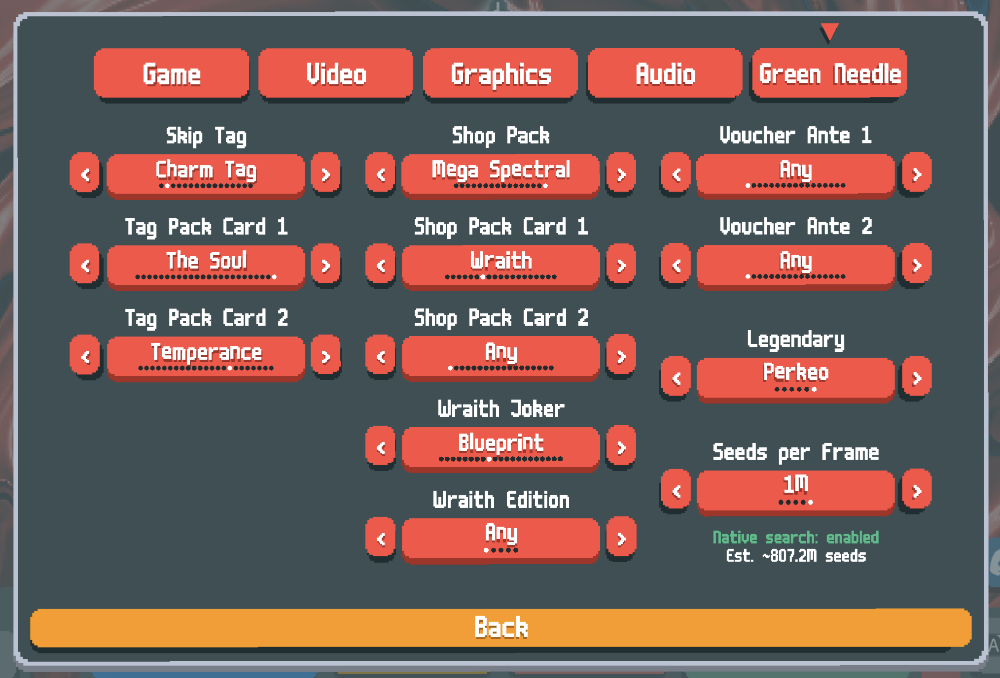

# Green Needle

A [Balatro](https://www.playbalatro.com/) mod for searching game seeds that match specific criteria. Find seeds with the exact skip tag, shop pack, vouchers, legendary joker, spectral cards, and pack contents you want before starting a run. Inspired by [Brainstorm](https://github.com/OceanRamen/Brainstorm), with a native C search engine, additional search filters, and a different approach to seed prediction.

Requires the [Lovely](https://github.com/ethangreen-dev/lovely-injector) mod loader.

*Configure search filters in the Green Needle settings tab:*



*Live search with progress counter and estimated total:*


## Features

- Search for seeds matching any combination of:
  - **Skip tag** (Charm Tag, Double Tag, etc.)
  - **Tag pack cards** (specific tarot cards in the Charm Tag's Mega Arcana pack)
  - **Shop pack type** (Arcana, Spectral, Buffoon, etc. — including size variants)
  - **Shop pack cards** (specific tarot or spectral cards in the shop pack)
  - **Spectral pack cards** (any of the 18 spectral cards, including The Soul and Black Hole)
  - **Wraith joker** — when Wraith is selected as a spectral pack card, optionally filter for a specific rare joker it creates
  - **Wraith edition** — filter the edition (Negative, Polychrome, Holographic, Foil) of the Wraith joker
  - **Voucher Ante 1** (Telescope, Crystal Ball, etc.)
  - **Voucher Ante 2** (dynamically filtered based on Ante 1 selection)
  - **Legendary joker** (Canio, Perkeo, etc.)
- **Estimated seed count** shown in the settings tab and search overlay so you know roughly how many seeds to expect before finding a match
- Native C search engine for fast multi-threaded searching (~millions of seeds/sec)
- Pure Lua fallback if the native library isn't available
- Live counter showing seeds searched and estimated total

## Installation

1. Install [Lovely](https://github.com/ethangreen-dev/lovely-injector) if you haven't already
2. Copy the `GreenNeedle` folder into your Balatro mods directory:
   - **macOS:** `~/Library/Application Support/Balatro/Mods/`
   - **Windows:** `%AppData%/Balatro/Mods/`
3. Launch Balatro — Green Needle will appear as a tab in the Settings menu

The mod works on all platforms via the pure-Lua search fallback. The pre-built native library (`greenneedle.dylib`) is macOS-only for now — see the Building section below if you'd like to compile for your platform.

## Usage

1. Open **Settings** and go to the **Green Needle** tab
2. Configure your search filters (any combination)
3. Start or be in a run, then press **Ctrl+A** to start searching
4. Press **Ctrl+A** again to stop the search
5. When a matching seed is found, a new run starts automatically with that seed

## Building the Native Library

The native search library provides dramatically faster searching. Pre-built for macOS (universal binary: Apple Silicon arm64 + Intel x86_64).

The C source (`native/greenneedle.c`) is portable C11 with no platform-specific dependencies — it should compile on Windows and Linux as well. Pre-built binaries for those platforms aren't provided yet; contributions welcome.

To rebuild on macOS:

```bash
cd native
./build_macos.sh
```

Requires Xcode Command Line Tools (`xcode-select --install`).

## Settings

Settings are saved automatically to `settings.lua` in the mod directory. Delete this file to reset to defaults.

## License

[Mozilla Public License 2.0](LICENSE)
